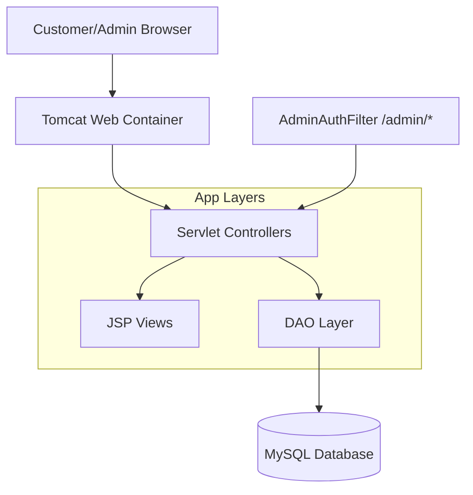
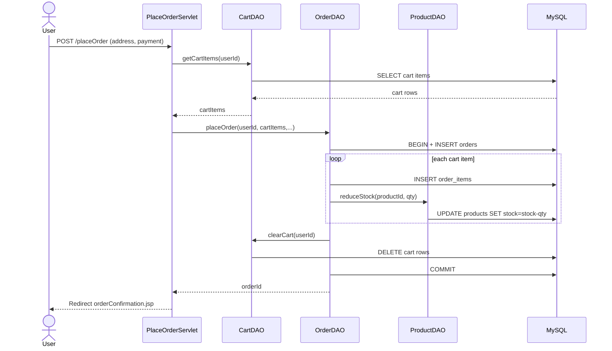
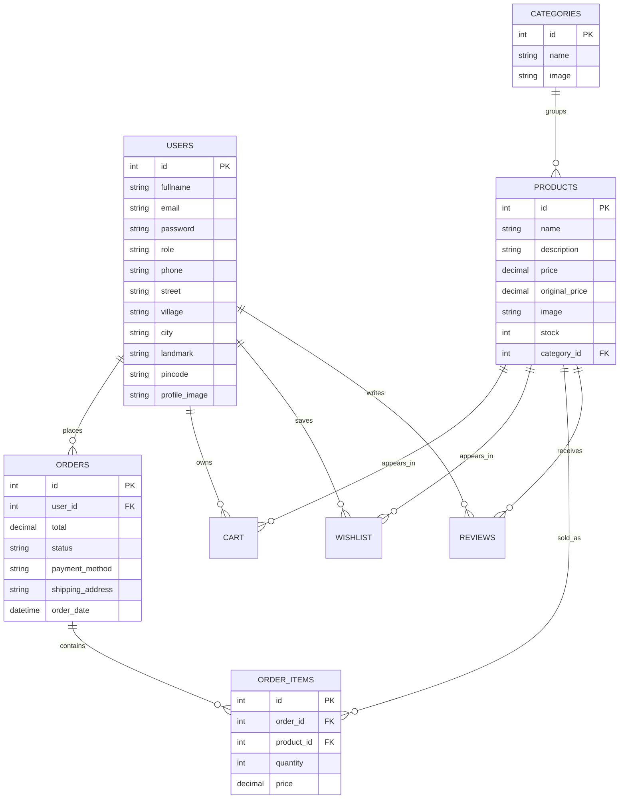

# AmesingStore Architecture Documentation

## 1.1 Project Overview

AmesingStore is a Java web e-commerce application packaged as a Maven WAR. It uses Servlet + JSP architecture with JDBC DAOs and a MySQL database. The platform supports customer shopping flows (browse, cart, checkout, orders) and an admin back office for product/category/order management.

## 1.1.1 Problem Statement

Retail businesses need a simple online commerce system that:

- works without complex infrastructure,
- supports product catalog and order lifecycle,
- provides role-based admin control,
- and keeps inventory/order records consistent.

The challenge is to achieve this with maintainable architecture and clear separation between UI, request handling, and data access.

## 4.1.2 The Solution

AmesingStore solves this through:

- Servlet controllers for use-case routing (`/home`, `/cart`, `/checkout`, `/admin/*`),
- JSP-based server-rendered views,
- DAO layer for all SQL operations,
- session-based authentication with admin filter protection,
- transactional order placement logic.

## 4.1.3 Key Objectives

1. Support user registration/login and profile address management.
2. Provide category-based product browsing and search.
3. Implement cart and wishlist flows for customers.
4. Ensure checkout validates stock and creates orders atomically.
5. Provide customer order history and order details.
6. Provide secure admin operations for catalog and order status.

## 4.2 Technical Stack

- Language: `Java 11`
- Web API: `Jakarta Servlet 5.0`
- View: `JSP + JSTL`
- Build: `Maven`
- Packaging: `WAR`
- Database: `MySQL` via `mysql-connector-java 8.0.33`
- Runtime target: Tomcat-compatible Jakarta container

> Note: `pom.xml` currently includes duplicate JSTL dependencies (both 2.x and 3.x entries). Consolidating to a single compatible set is recommended.

## 4.3 Architecture: The MVC Pattern

This codebase follows a classical MVC layering:

- **Model:** POJOs in `com.amesingstore.model`
- **Controller:** Servlets in `com.amesingstore.controller` and `com.amesingstore.controller.admin`
- **View:** JSP pages under `src/main/webapp`
- **Data access:** DAOs in `com.amesingstore.dao`

Flow:

1. Browser sends request to servlet endpoint.
2. Controller validates session/role and orchestrates business flow.
3. DAO executes SQL and returns models.
4. Controller forwards to JSP with request attributes.

## 4.4 Logic Module Overview

Important shared logic components:

- `DBConnection`: central JDBC connection provider (`DriverManager`).
- `AdminAuthFilter`: guards `/admin/`* and allows only `user.role == "admin"`.
- `OrderDAO.placeOrder(...)`: order transaction orchestration (insert order, insert items, reduce stock, clear cart).

## 4.5 Registration Module Overview

Primary files:

- `register.jsp`
- `RegisterServlet`
- `UserDAO.register`

Behavior:

- multipart form supports optional profile image upload,
- creates `User` object with contact/address data,
- inserts into `users` table,
- redirects to login on success; on duplicate email returns registration error.

## 4.6 Home Module Overview

Primary files:

- `HomeServlet`
- `index.jsp`
- `ProductDAO`, `CategoryDAO`

Behavior:

- loads products (all or by category query param),
- loads categories for filters/navigation,
- forwards data to home JSP for server-side rendering.

## 4.7 Cart Module Overview

Primary files:

- `AddToCartServlet`, `CartServlet`, `UpdateCartServlet`, `RemoveFromCartServlet`
- `CartDAO`
- `cart.jsp`

Behavior:

- requires authenticated session,
- prevents add-to-cart when product is out of stock,
- supports quantity updates and item removal,
- computes total before rendering cart view.

## 4.8 Admin Module Overview

Primary files:

- `AdminAuthFilter`
- `AdminDashboardServlet`, `AdminProductsServlet`, `AdminCategoriesServlet`, `AdminOrdersServlet`
- `AdminEditProductServlet`, `AdminDeleteProductServlet`, `AdminUpdateOrderServlet`, `AdminDeleteCategoryServlet`
- JSPs under `src/main/webapp/admin`

Behavior:

- role-based route protection via filter,
- dashboard metrics from orders/products,
- catalog CRUD operations,
- order status management.

## Checkout Module Overview

Primary files:

- `CheckoutServlet`
- `PlaceOrderServlet`
- `OrderDAO.placeOrder`
- `checkout.jsp`, `orderConfirmation.jsp`

Behavior:

- validates login and non-empty cart,
- re-checks stock before checkout page load,
- captures shipping details + payment method,
- places order in transactional flow and redirects to confirmation.

## 4.9 Order History Module Overview

Primary files:

- `OrderHistoryServlet`
- `OrderDetailServlet`
- `OrderDAO.getOrdersByUser`, `OrderDAO.getOrderById`
- `orderHistory.jsp`, `orderDetail.jsp`

Behavior:

- loads user-specific orders sorted by latest date,
- supports detailed view including line items.

## 4.10 High Level Design Diagram and Explanation

Explanation:

- Controllers coordinate each request path.
- Views are server-rendered JSP pages.
- DAO layer isolates SQL and DB mapping.
- Filter provides cross-cutting admin authorization.

## 4.11 Low Level Design and Explanation

Explanation:

- `PlaceOrderServlet` orchestrates request data and delegates persistence.
- `OrderDAO.placeOrder` manages transaction boundaries.
- stock reduction and cart clear happen in the same logical order flow.

## 4.12 ER Diagram and Explanation

Explanation:

- The schema supports customer lifecycle and admin reporting.
- `ORDERS` + `ORDER_ITEMS` implement normalized purchase records.
- `CART` and `WISHLIST` represent transient and saved intent separately.
- `REVIEWS` ties customer feedback to purchased products.

## 4.12 Testing Table and Testing Information

The table below is a recommended regression checklist derived from current code paths.

| Test ID | Module         | Scenario                           | Expected Result                          |
| ------- | -------------- | ---------------------------------- | ---------------------------------------- |
| T01     | Registration   | Register with unique email         | User row created; redirect to login      |
| T02     | Registration   | Register with duplicate email      | Registration error rendered              |
| T03     | Login          | Invalid credentials                | Login page shows error                   |
| T04     | Home           | Category filter applied            | Only category products displayed         |
| T05     | Cart           | Add out-of-stock product           | Block add and return with error          |
| T06     | Cart           | Update quantity                    | Cart line updates and total recalculates |
| T07     | Checkout       | Checkout with empty cart           | Redirect to cart                         |
| T08     | Checkout       | Place order happy path             | Order + items created, cart cleared      |
| T09     | Orders         | Open order history                 | User orders shown in descending date     |
| T10     | Admin Security | Non-admin opens `/admin/dashboard` | Redirect to login                        |
| T11     | Admin Catalog  | Create/update/delete product       | DB and listing reflect change            |
| T12     | Admin Orders   | Update order status                | Status persists and appears in list      |

Testing notes:

- Current repository has no automated JUnit test suite committed.
- Recommended layering:
  - DAO integration tests against isolated test DB.
  - Servlet integration tests using embedded container/mocks.
  - UI smoke tests for critical pages and redirects.

## 4.13 Future Enhancement

1. Hash passwords (BCrypt/Argon2) and remove plaintext storage.
2. Externalize DB credentials to environment/secret manager.
3. Introduce connection pooling (HikariCP).
4. Add centralized exception handling and audit logging.
5. Add automated test suite in CI pipeline.
6. Add pagination/filter/sort for large product and order data.
7. Add payment gateway integration and webhook-based payment status.
8. Move toward service layer + DTOs for cleaner separation.

## 4.14 Conclusion

AmesingStore is a solid Servlet/JSP e-commerce foundation with clear MVC boundaries and practical module separation. Core business flows (registration, catalog, cart, checkout, order tracking, admin operations) are present and cohesive. With targeted security hardening, configuration cleanup, and automated testing, it can evolve from academic/prototype maturity to production-readiness.