# AmesingStore — Low-Level Design (LLD)

---

## 1. Package & Class Structure

```
com.amesingstore
├── util
│   └── DBConnection.java              ← static getConnection()
├── model
│   ├── User.java
│   ├── Product.java
│   ├── Category.java
│   ├── CartItem.java
│   ├── WishlistItem.java
│   ├── Order.java
│   ├── OrderItem.java
│   └── Review.java
├── dao
│   ├── UserDAO.java
│   ├── ProductDAO.java
│   ├── CategoryDAO.java
│   ├── CartDAO.java
│   ├── WishlistDAO.java
│   ├── OrderDAO.java
│   └── ReviewDAO.java
└── controller
    ├── AdminAuthFilter.java           ← @WebFilter("/admin/*")
    ├── LoginServlet.java              ← POST /login
    ├── LogoutServlet.java             ← GET  /logout
    ├── RegisterServlet.java           ← POST /register
    ├── HomeServlet.java               ← GET  /home
    ├── ProductServlet.java            ← GET  /product
    ├── SearchServlet.java             ← GET  /search
    ├── CartServlet.java               ← GET  /cart
    ├── AddToCartServlet.java          ← POST /addToCart
    ├── UpdateCartServlet.java         ← POST /updateCart
    ├── RemoveFromCartServlet.java     ← POST /removeFromCart
    ├── WishlistServlet.java           ← GET  /wishlist
    ├── AddToWishlistServlet.java      ← POST /addToWishlist
    ├── RemoveFromWishlistServlet.java ← POST /removeFromWishlist
    ├── CheckoutServlet.java           ← GET  /checkout
    ├── PlaceOrderServlet.java         ← POST /placeOrder
    ├── OrderHistoryServlet.java       ← GET  /orderHistory
    ├── OrderDetailServlet.java        ← GET  /orderDetail
    ├── AccountSettingsServlet.java    ← GET+POST /account
    ├── UpdateAddressServlet.java      ← POST /updateAddress
    ├── BuyNowServlet.java             ← POST /buyNow
    ├── SubmitReviewServlet.java       ← POST /submitReview
    └── admin
        ├── AdminDashboardServlet.java    ← GET  /admin/dashboard
        ├── AdminProductsServlet.java     ← GET  /admin/products
        ├── AdminEditProductServlet.java  ← GET+POST /admin/editProduct
        ├── AdminDeleteProductServlet.java← POST /admin/deleteProduct
        ├── AdminCategoriesServlet.java   ← GET+POST /admin/categories
        ├── AdminDeleteCategoryServlet.java← POST /admin/deleteCategory
        ├── AdminOrdersServlet.java       ← GET  /admin/orders
        └── AdminUpdateOrderServlet.java  ← POST /admin/updateOrder
```

---

## 2. Class Diagram — Model Layer

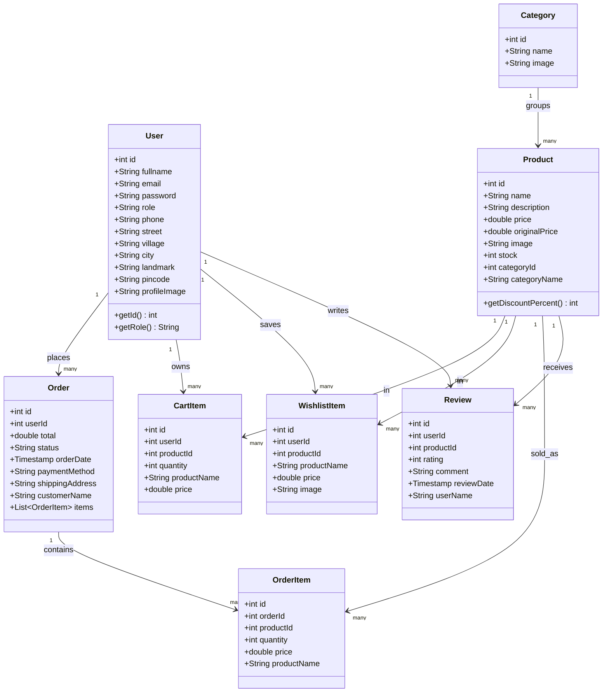

---

## 3. Class Diagram — DAO Layer

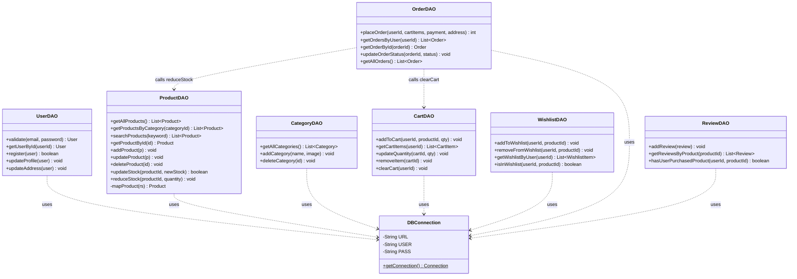

---

## 4. Sequence Diagram — Login Flow

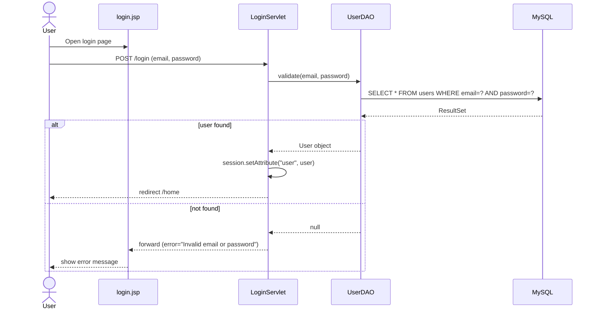

---

## 5. Sequence Diagram — Registration Flow

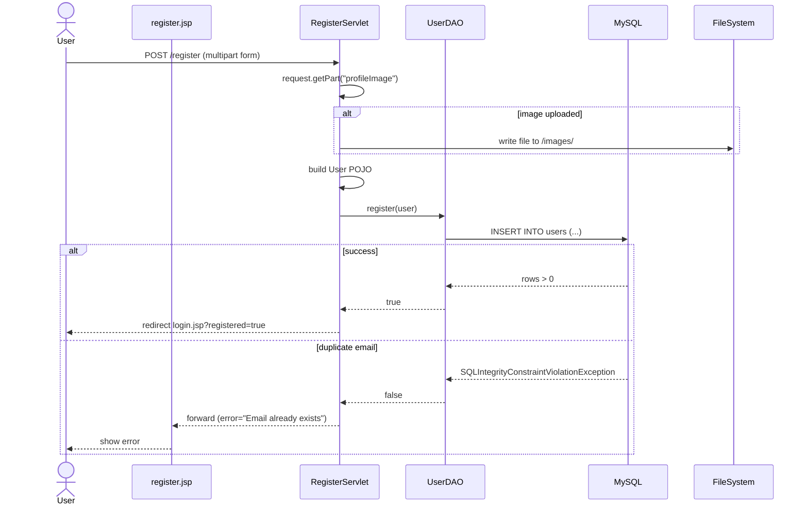

---

## 6. Sequence Diagram — Home / Browse Products

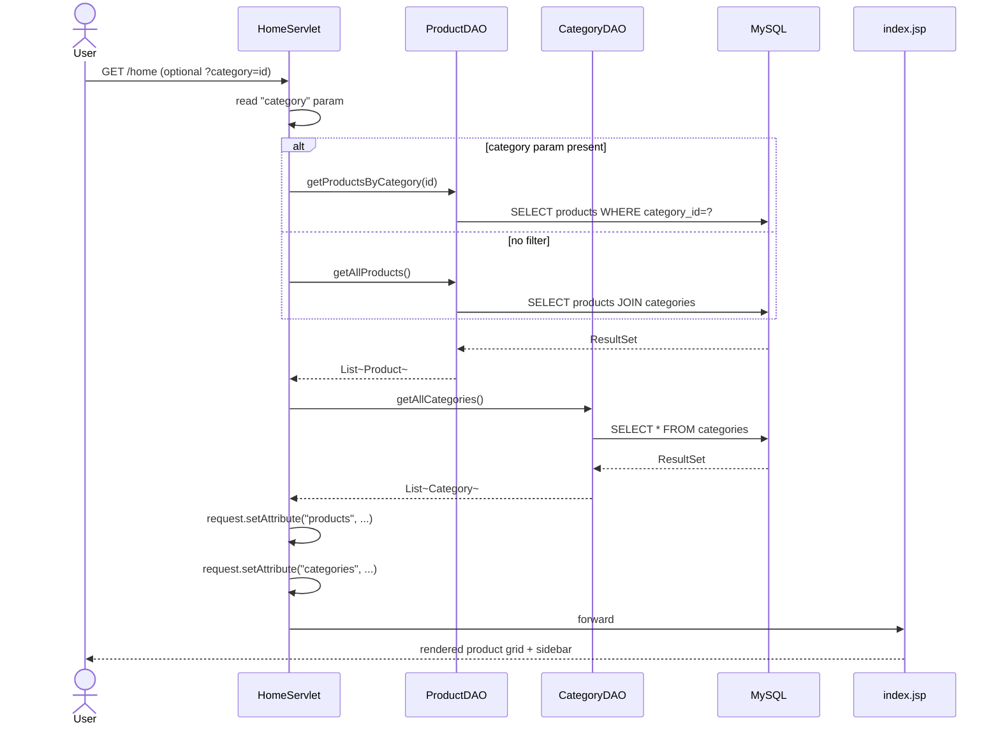

---

## 7. Sequence Diagram — Add to Cart

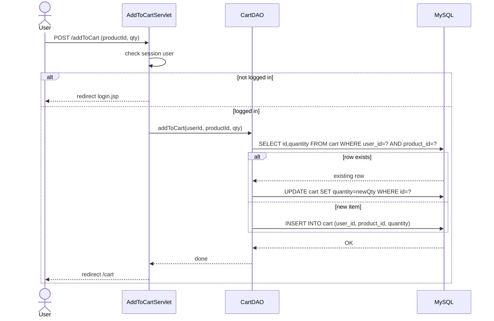

---

## 8. Sequence Diagram — Checkout & Place Order

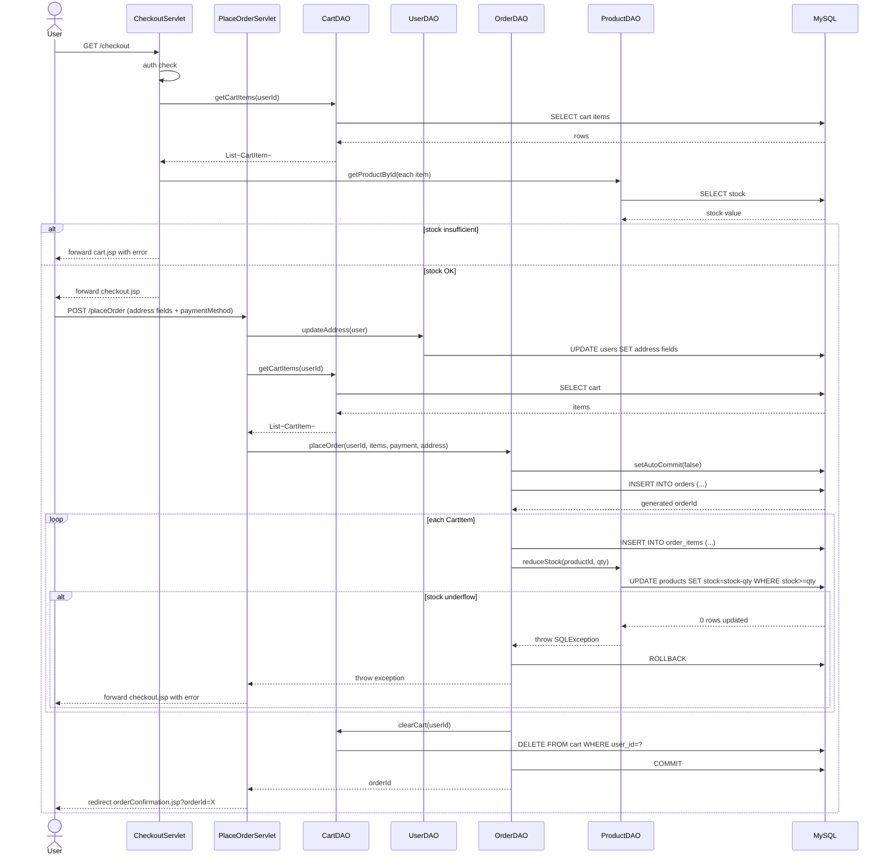

---

## 9. Sequence Diagram — Order History & Detail

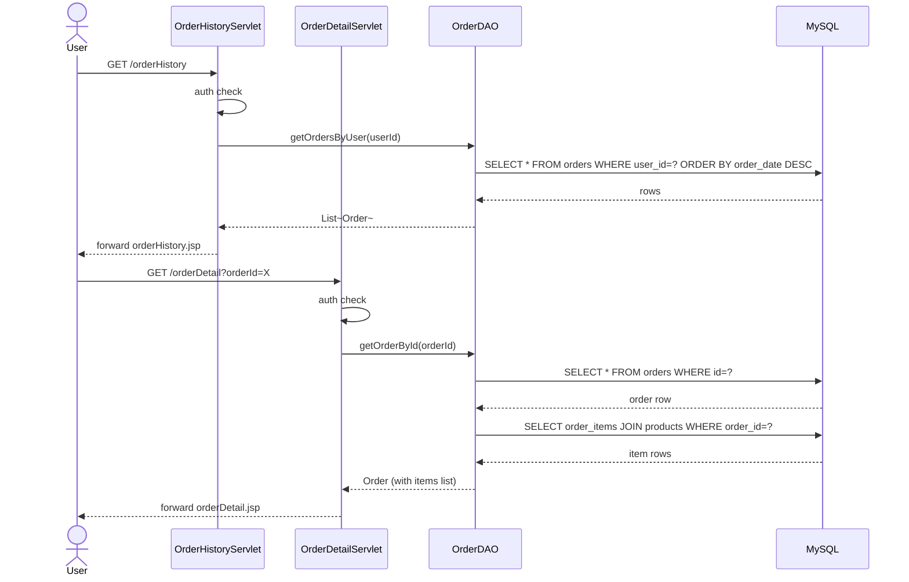

---

## 10. Sequence Diagram — Admin Dashboard

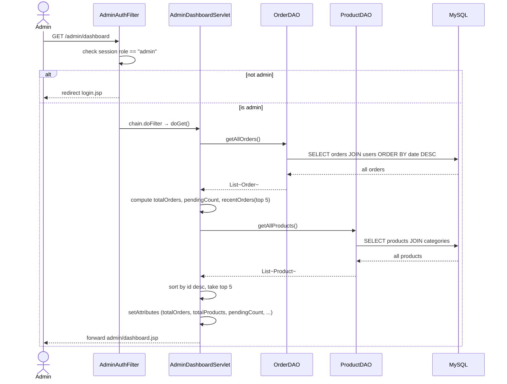

---

## 11. Sequence Diagram — Admin Edit Product

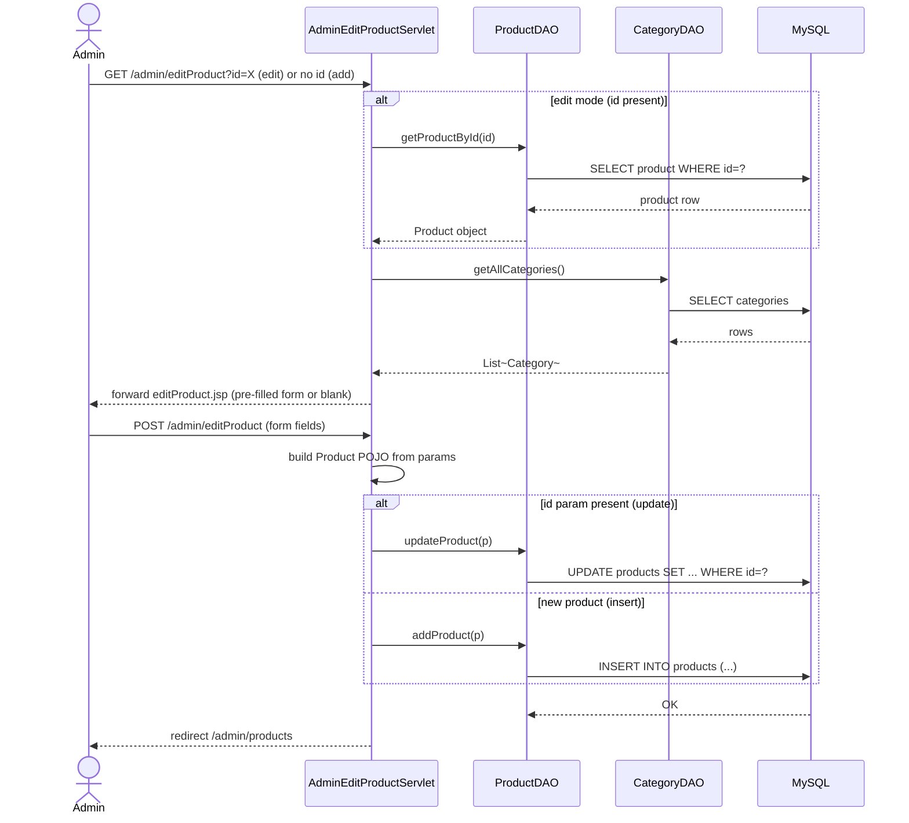

---

## 12. Sequence Diagram — Review Submission

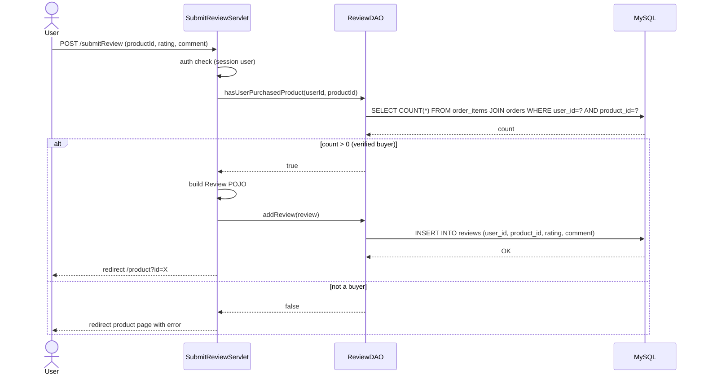

---

## 13. AdminAuthFilter Logic Flow

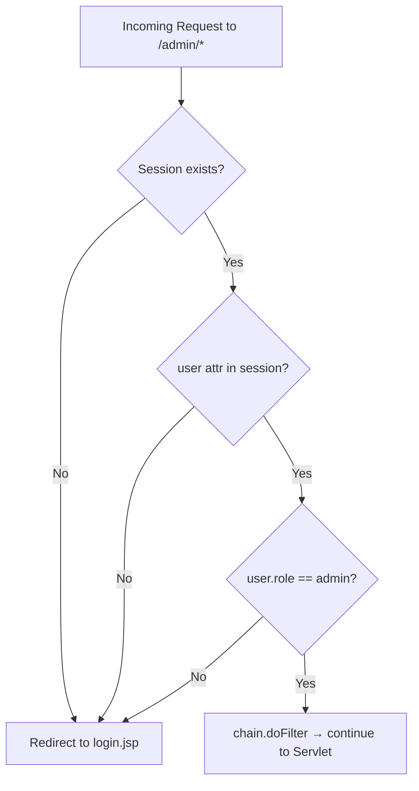

---

## 14. CartDAO Upsert Logic Flow

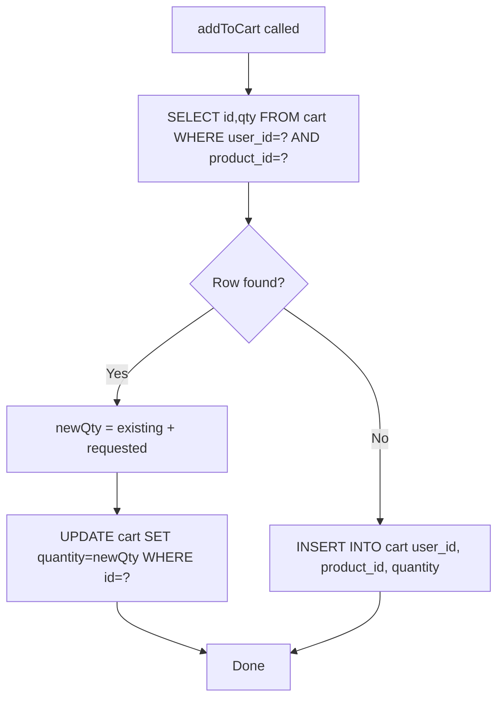

---

## 15. OrderDAO Transaction Flow

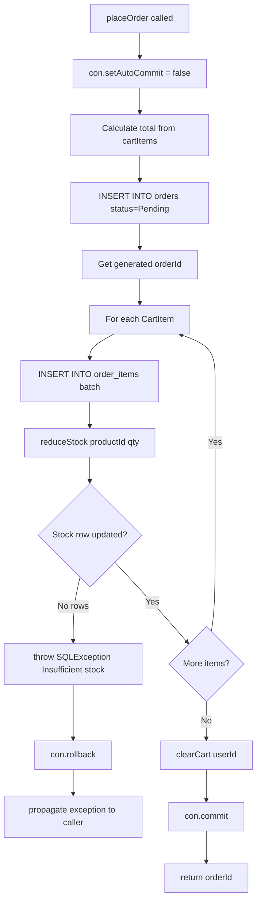

---

## 16. Servlet URL Mapping Summary

| URL Pattern | HTTP Method | Servlet | Auth Required |
|---|---|---|---|
| `/home` | GET | HomeServlet | No |
| `/login` | POST | LoginServlet | No |
| `/register` | POST | RegisterServlet | No |
| `/logout` | GET | LogoutServlet | No |
| `/product` | GET | ProductServlet | No |
| `/search` | GET | SearchServlet | No |
| `/cart` | GET | CartServlet | Yes (user) |
| `/addToCart` | POST | AddToCartServlet | Yes (user) |
| `/updateCart` | POST | UpdateCartServlet | Yes (user) |
| `/removeFromCart` | POST | RemoveFromCartServlet | Yes (user) |
| `/wishlist` | GET | WishlistServlet | Yes (user) |
| `/addToWishlist` | POST | AddToWishlistServlet | Yes (user) |
| `/removeFromWishlist` | POST | RemoveFromWishlistServlet | Yes (user) |
| `/checkout` | GET | CheckoutServlet | Yes (user) |
| `/placeOrder` | POST | PlaceOrderServlet | Yes (user) |
| `/buyNow` | POST | BuyNowServlet | Yes (user) |
| `/orderHistory` | GET | OrderHistoryServlet | Yes (user) |
| `/orderDetail` | GET | OrderDetailServlet | Yes (user) |
| `/account` | GET+POST | AccountSettingsServlet | Yes (user) |
| `/updateAddress` | POST | UpdateAddressServlet | Yes (user) |
| `/submitReview` | POST | SubmitReviewServlet | Yes (user) |
| `/admin/dashboard` | GET | AdminDashboardServlet | Yes (admin) |
| `/admin/products` | GET | AdminProductsServlet | Yes (admin) |
| `/admin/editProduct` | GET+POST | AdminEditProductServlet | Yes (admin) |
| `/admin/deleteProduct` | POST | AdminDeleteProductServlet | Yes (admin) |
| `/admin/categories` | GET+POST | AdminCategoriesServlet | Yes (admin) |
| `/admin/deleteCategory` | POST | AdminDeleteCategoryServlet | Yes (admin) |
| `/admin/orders` | GET | AdminOrdersServlet | Yes (admin) |
| `/admin/updateOrder` | POST | AdminUpdateOrderServlet | Yes (admin) |

---

## 17. Key SQL Queries Reference

### UserDAO
```sql
-- Login
SELECT * FROM users WHERE email=? AND password=?

-- Register
INSERT INTO users (fullname, email, password, phone, street, village, city, landmark, pincode, profile_image)
VALUES (?, ?, ?, ?, ?, ?, ?, ?, ?, ?)

-- Update address
UPDATE users SET phone=?, street=?, village=?, city=?, landmark=?, pincode=? WHERE id=?
```

### ProductDAO
```sql
-- All products with category
SELECT p.*, c.name as category_name FROM products p
LEFT JOIN categories c ON p.category_id = c.id

-- Reduce stock (atomic check)
UPDATE products SET stock = stock - ? WHERE id=? AND stock >= ?

-- Search
SELECT p.*, c.name as category_name FROM products p
LEFT JOIN categories c ON p.category_id = c.id WHERE p.name LIKE ?
```

### CartDAO
```sql
-- Upsert check
SELECT id, quantity FROM cart WHERE user_id=? AND product_id=?

-- Get cart with prices
SELECT c.id, c.product_id, c.quantity, p.name, p.price
FROM cart c JOIN products p ON c.product_id = p.id WHERE c.user_id=?
```

### OrderDAO
```sql
-- Place order header
INSERT INTO orders (user_id, total, status, payment_method, shipping_address)
VALUES (?, ?, 'Pending', ?, ?)

-- Order items batch
INSERT INTO order_items (order_id, product_id, quantity, price) VALUES (?,?,?,?)

-- User orders
SELECT * FROM orders WHERE user_id=? ORDER BY order_date DESC

-- Admin: all orders with customer name
SELECT o.*, u.fullname AS customer_name FROM orders o
JOIN users u ON o.user_id = u.id ORDER BY o.order_date DESC
```

### ReviewDAO
```sql
-- Verified purchase check
SELECT COUNT(*) FROM order_items oi
JOIN orders o ON oi.order_id = o.id
WHERE o.user_id=? AND oi.product_id=?

-- Product reviews
SELECT r.*, u.fullname FROM reviews r
JOIN users u ON r.user_id = u.id
WHERE r.product_id=? ORDER BY r.review_date DESC
```

---

*LLD — AmesingStore v1.0-SNAPSHOT — May 2026*
